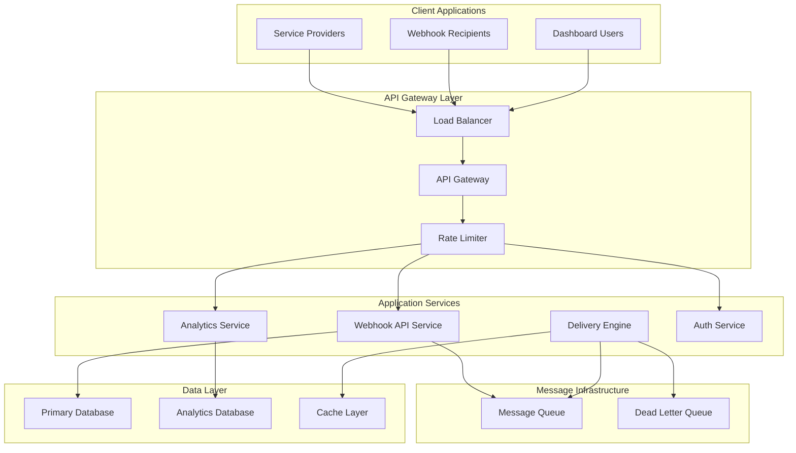

# Webhook Service Platform Design

## Overview

The webhook service platform is designed as a multi-tenant, cloud-native service that provides reliable webhook delivery infrastructure. The system follows microservices architecture with event-driven communication, ensuring scalability, reliability, and security for enterprise-grade webhook operations.

## Architecture

### High-Level Architecture



### Core Components

1. **API Gateway**: Handles routing, authentication, rate limiting, and request/response transformation
2. **Webhook API Service**: Manages webhook endpoints, configurations, and delivery requests
3. **Delivery Engine**: Processes webhook deliveries with retry logic and failure handling
4. **Analytics Service**: Collects metrics, generates reports, and provides monitoring capabilities
5. **Authentication Service**: Manages API keys, tenant isolation, and access controls

## Components and Interfaces

### Webhook API Service

**Responsibilities:**
- Webhook endpoint CRUD operations
- Payload validation and preprocessing
- Delivery request queuing
- Tenant management and isolation

**Key Interfaces:**
```typescript
interface WebhookEndpoint {
  id: string;
  tenantId: string;
  url: string;
  secret: string;
  isActive: boolean;
  retryConfig: RetryConfiguration;
  headers: Record<string, string>;
  createdAt: Date;
  updatedAt: Date;
}

interface DeliveryRequest {
  id: string;
  endpointId: string;
  payload: any;
  headers: Record<string, string>;
  scheduledAt: Date;
  attempts: number;
  maxAttempts: number;
}
```

### Delivery Engine

**Responsibilities:**
- Webhook HTTP delivery execution
- Retry logic with exponential backoff
- Failure handling and dead letter processing
- Signature generation and verification

**Key Interfaces:**
```typescript
interface DeliveryResult {
  deliveryId: string;
  status: 'success' | 'failed' | 'retrying';
  httpStatus?: number;
  responseBody?: string;
  errorMessage?: string;
  deliveredAt?: Date;
  nextRetryAt?: Date;
}

interface RetryConfiguration {
  maxAttempts: number;
  initialDelayMs: number;
  maxDelayMs: number;
  backoffMultiplier: number;
}
```

### Analytics Service

**Responsibilities:**
- Real-time metrics collection
- Historical data aggregation
- Dashboard data preparation
- Alert generation

**Key Interfaces:**
```typescript
interface DeliveryMetrics {
  tenantId: string;
  endpointId: string;
  timestamp: Date;
  status: string;
  latencyMs: number;
  httpStatus?: number;
}

interface AnalyticsQuery {
  tenantId: string;
  startDate: Date;
  endDate: Date;
  filters: {
    endpointIds?: string[];
    statuses?: string[];
  };
  groupBy: 'hour' | 'day' | 'week';
}
```

## Data Models

### Primary Database Schema

**Tenants Table:**
```sql
CREATE TABLE tenants (
  id UUID PRIMARY KEY,
  name VARCHAR(255) NOT NULL,
  api_key_hash VARCHAR(255) NOT NULL,
  subscription_tier VARCHAR(50) NOT NULL,
  rate_limit_per_minute INTEGER NOT NULL,
  monthly_quota INTEGER NOT NULL,
  created_at TIMESTAMP NOT NULL,
  updated_at TIMESTAMP NOT NULL
);
```

**Webhook Endpoints Table:**
```sql
CREATE TABLE webhook_endpoints (
  id UUID PRIMARY KEY,
  tenant_id UUID NOT NULL REFERENCES tenants(id),
  url VARCHAR(2048) NOT NULL,
  secret_hash VARCHAR(255) NOT NULL,
  is_active BOOLEAN DEFAULT true,
  retry_config JSONB NOT NULL,
  custom_headers JSONB,
  created_at TIMESTAMP NOT NULL,
  updated_at TIMESTAMP NOT NULL,
  INDEX idx_tenant_endpoints (tenant_id, is_active)
);
```

**Delivery Attempts Table:**
```sql
CREATE TABLE delivery_attempts (
  id UUID PRIMARY KEY,
  endpoint_id UUID NOT NULL REFERENCES webhook_endpoints(id),
  payload_hash VARCHAR(64) NOT NULL,
  payload_size INTEGER NOT NULL,
  status VARCHAR(20) NOT NULL,
  http_status INTEGER,
  response_body TEXT,
  error_message TEXT,
  attempt_number INTEGER NOT NULL,
  scheduled_at TIMESTAMP NOT NULL,
  delivered_at TIMESTAMP,
  created_at TIMESTAMP NOT NULL,
  INDEX idx_endpoint_status (endpoint_id, status),
  INDEX idx_scheduled_deliveries (scheduled_at, status)
);
```

### Message Queue Schema

**Delivery Queue Message:**
```json
{
  "deliveryId": "uuid",
  "endpointId": "uuid",
  "tenantId": "uuid",
  "payload": {},
  "headers": {},
  "attemptNumber": 1,
  "scheduledAt": "2024-01-01T00:00:00Z",
  "signature": "sha256=..."
}
```

## Error Handling

### Error Categories

1. **Client Errors (4xx)**
   - Invalid payload format
   - Authentication failures
   - Rate limit exceeded
   - Quota exceeded

2. **Server Errors (5xx)**
   - Database connection failures
   - Message queue unavailability
   - Internal service errors

3. **Delivery Errors**
   - Target endpoint unreachable
   - Timeout errors
   - Invalid response from target

### Error Response Format

```json
{
  "error": {
    "code": "INVALID_PAYLOAD",
    "message": "Webhook payload exceeds maximum size limit",
    "details": {
      "maxSizeBytes": 1048576,
      "actualSizeBytes": 2097152
    },
    "timestamp": "2024-01-01T00:00:00Z",
    "requestId": "req_123456"
  }
}
```

### Retry Strategy

```typescript
interface RetryStrategy {
  calculateDelay(attemptNumber: number, config: RetryConfiguration): number;
  shouldRetry(error: DeliveryError, attemptNumber: number): boolean;
  getRetryableStatusCodes(): number[];
}

// Implementation uses exponential backoff with jitter
// Retryable: 408, 429, 500, 502, 503, 504
// Non-retryable: 400, 401, 403, 404, 410
```

## Testing Strategy

### Unit Testing
- Service layer business logic
- Retry algorithm implementations
- Signature generation and verification
- Data validation and transformation

### Integration Testing
- Database operations and transactions
- Message queue publishing and consumption
- HTTP client webhook delivery
- Authentication and authorization flows

### End-to-End Testing
- Complete webhook delivery workflows
- Multi-tenant isolation verification
- Rate limiting and quota enforcement
- Analytics data collection and reporting

### Performance Testing
- Load testing for concurrent webhook deliveries
- Stress testing for queue processing capacity
- Latency testing for delivery response times
- Scalability testing for multi-tenant workloads

### Security Testing
- API authentication and authorization
- Webhook signature verification
- Tenant data isolation
- Input validation and sanitization

### Monitoring and Observability

**Key Metrics:**
- Delivery success rate by tenant/endpoint
- Average delivery latency
- Queue depth and processing rate
- API response times and error rates
- Resource utilization (CPU, memory, database connections)

**Alerting Rules:**
- Delivery success rate below 95%
- Queue depth exceeding threshold
- High error rates for specific tenants
- Database connection pool exhaustion
- Memory or CPU usage above 80%

**Logging Strategy:**
- Structured JSON logging with correlation IDs
- Separate log levels for different components
- Sensitive data redaction (payloads, secrets)
- Centralized log aggregation and search

This design provides a robust, scalable foundation for a webhook-as-a-service platform that can handle enterprise-scale workloads while maintaining security, reliability, and observability.